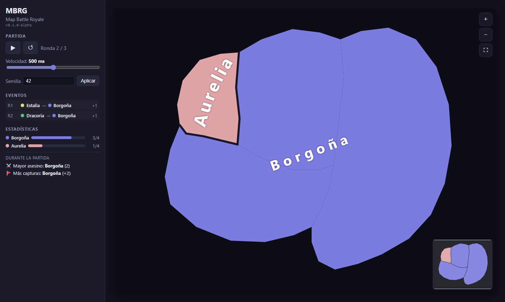
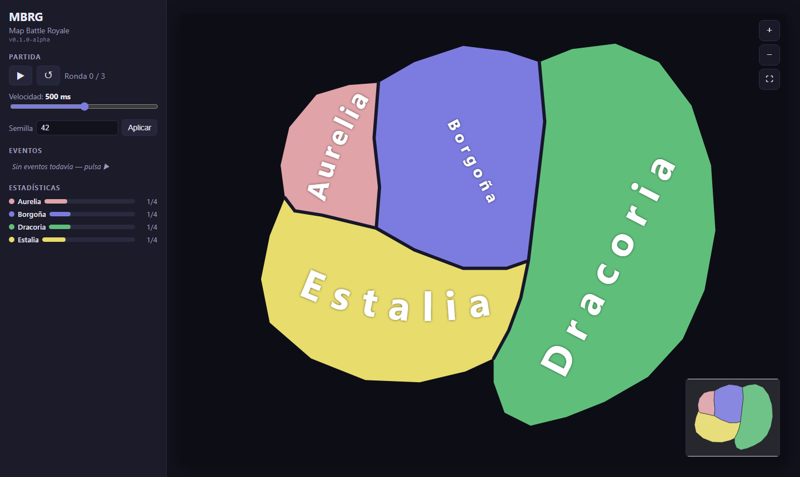

# MBRG — Map Battle Royale Game

Un **Battle Royale para mapas tipo EU4 / RISK**: cada ronda una facción es
eliminada al azar y una facción vecina se queda con **todas** sus provincias,
hasta que solo queda una en pie.

Lo interesante aquí no es jugar: es **espectar y predecir**. La partida se
calcula entera a partir de una semilla, así que cualquiera con el enlace sabe
qué va a pasar… y por eso la versión actual es un visor, no un juego de
apuestas (todavía no).



## Estado actual: `v0.1.0-alpha`

Es la **primera versión jugable**, y es un principio en toda la regla:

- ✅ Un mapa (artesanal, embebido en el código)
- ✅ Simulación determinista del modo "Clásico"
- ✅ Reproducción por rondas con animación, registro y estadísticas
- ✅ Semilla compartible por URL
- ❌ **Sin servidor** (nada de historial, rankings ni calendario de rondas)
- ❌ **Sin predicciones ni apuestas** (llega en la Fase 3)
- ❌ **Sin Discord** (Fase 4)
- ❌ **No se pueden subir mapas** (el importador es la Fase 2)

### Una advertencia importante

La semilla va en la URL y la partida se calcula **en tu navegador**. Eso
significa que cualquiera con el enlace puede leer la semilla y calcular las
rondas siguientes, es decir, **spoilers**. Para un visor da igual, pero
**rompe por completo cualquier apuesta**: por eso esta versión no trae nada de
apuestas, y la Fase 3 (precalcular en servidor y revelar ronda a ronda) es
precisamente lo que lo arregla.

## Cómo jugar

1. Abre la [demo publicada](https://agarc.github.io/mbrg/).
2. Pulsa **▶**. Cada ronda cae una facción y otra se la come entera.
3. Cambia la **semilla** y pulsa *Aplicar* para generar otra partida distinta.
4. Comparte la URL: lleva la semilla dentro, así que quien la abre ve **exactamente
   tu misma partida**.



Controles: rueda o pinza para hacer zoom, arrastrar para mover la vista, doble
clic para acercar, y el minimapa de la esquina para desplazarte.

## Cómo se ejecuta en local

```bash
npm install       # instala dependencias y enlaza los paquetes del monorepo
npm run dev       # servidor de desarrollo → http://localhost:5173
npm run build     # compila los paquetes (tsc -b) y la web (vite build)
npm test          # tests (vitest run, sin necesidad de compilar antes)
npm run test:watch
npm run typecheck
```

## Estructura

Monorepo de TypeScript con *workspaces*. La misma simulación determinista se
ejecuta en los tests, en el servidor, en el bot y en el navegador — el render es
la única capa que se puede sustituir (por ejemplo por Three.js en el futuro).

| Ruta | Qué hay |
| --- | --- |
| `packages/shared` | Formato de mapa (`MapFormatV1`), validación, adyacencia y tipos de partida |
| `packages/sim` | El motor: `step()` (una ronda), `simulate()` (partida completa), PRNG con semilla |
| `apps/web` | El visor: render en canvas, reproducción, cámara, minimapa, registro, estadísticas |

## Reglas del modo "Clásico"

En cada ronda:

1. Se elige una facción viva **al azar**.
2. Sus vecinas candidatas son las que comparten frontera con **alguna** de sus
   provincias.
3. Una de ellas se queda con **todas** sus provincias.
4. Se repite hasta que queda una sola facción.

## Roadmap

| Versión | Qué trae |
| --- | --- |
| `v0.1.0-alpha` | Lo de arriba: un mapa, sin servidor |
| `v0.2.0` | **Importador de mapas**: sube una imagen y conviértela en mapa jugable |
| `v0.3.0` | **Servidor + predicciones**: se wager, se acierta, hay puntuación |
| `v0.4.0` | **Bot de Discord**: jugar desde el chat, rankings por servidor |
| `v1.0` | Varios modos de juego, editor de mapas, 3D |

## Licencia

[MIT](LICENSE) © 2026 Ángel García
